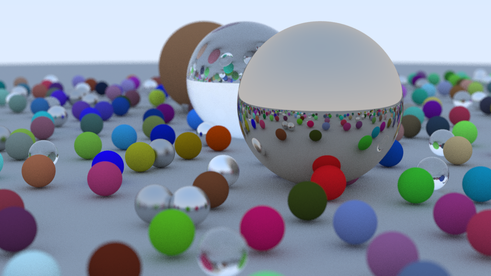
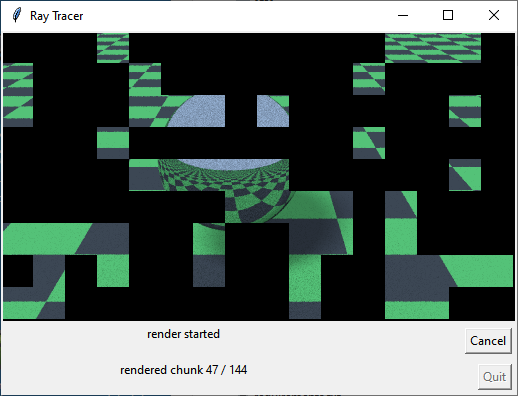
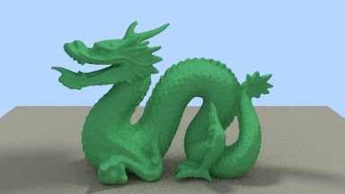
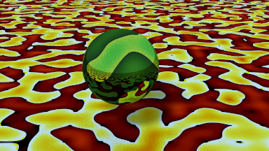
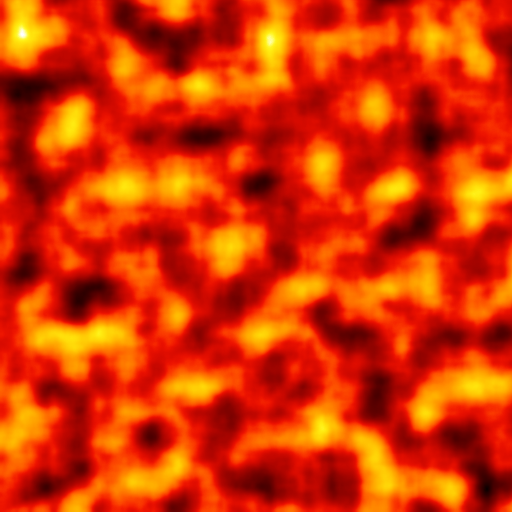
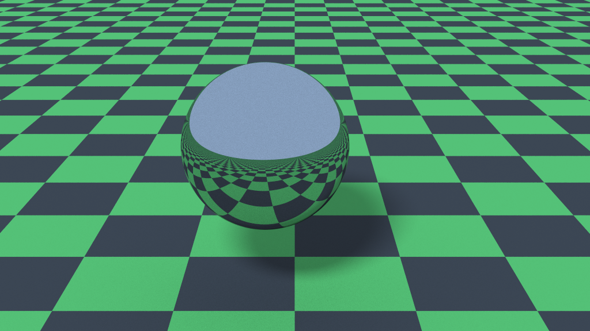
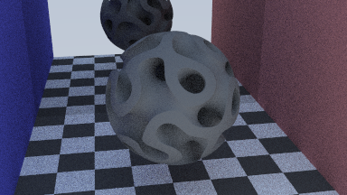
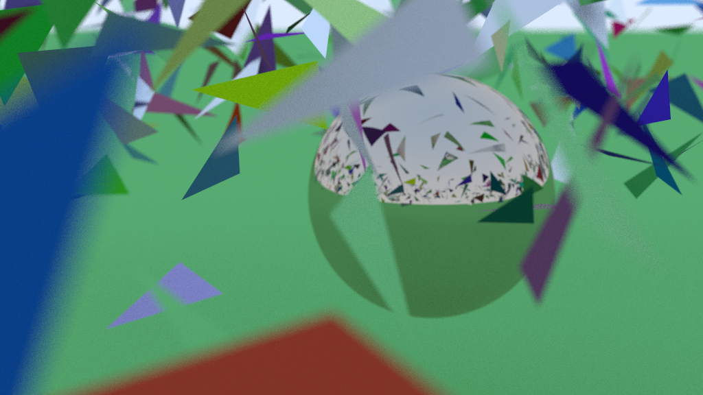

# Python Ray Tracer

This is an implementation of a Python ray tracer base on Pete Shirley's [Ray Tracing in One Weekend](https://raytracing.github.io/) books.

## Implemented Features

    - Primitives: Sphere, Disc Triangle, Plane, STL Files (triangle meshes)
    - Texture mapping: SolidColor, CheckerBoard, ImageTexture
    - Noise textures using [Perlin noise](https://en.wikipedia.org/wiki/Perlin_noise) for solid textures.
    - Lighting: Point lights, Area lights (can use any Geometry with a point_on method -- triangle, disc, 
        sphere, etc.) 
    - Shadow rays for shadowing. Area lights drive their own shadow ray sampling for soft shadows.
    - BVH (bounding volume hieraerchy)
    - models: teapots, bunnies, etc.

## Install

1. Install Python 3.6+
2. For the gui version, make sure tkinter is available (type: *python -c "import tkinter"* to test). If this fails
you'll need to install tkinter for your platform
3. Download/clone this git repository
4. install the required packages: *pip install -r requirements.txt*

note 1: I have not tested the install on other systems. Let me know if there's an issue.

note 2: It is better form to put it in it's own virtual environment. See various web tutorials on how to do that.

## Running the code

The easiest with to run the program is to use the GUI:

    type: *python rt_gui.py*
    
Then Click on the *start* button to start the rendering. The image will be saved in the current working directory
as *rt.png* (unless changed by the IMAGE_FILENAME environment variable.)
    
note: There are a lot of features that could be added to the GUI. Top of the list is to set the scene file from a
command line option or menu item. For now it is hard-coded in the code. To change the scene, set the 
CREATOR_FUNC variable:

    CREATOR_FUNC = create_canonical_1
    
There are several sample scene files in *create_scene_funcs.py*.    

The program can be run from the command line with:

    python rt.py

There are a number of environment variables that can be used to control the execution. These can also be store
in a .env file for convenience:

    - SAMPLES_PER_PIXEL (int e.g. 50)
    - SAMPLES_PER_LIGHT (int e.g. 100)
    - USE_RES: low', 'med', 'high', or 'ultra'. Sets to the settings in res_settings. Each can be overwritten by the
        variables below.
    - X_SIZE: x size of the rendered image
    - ASPECT_RATIO: aspect ratio of the rendered image -- used to calculate y size (default is 16:9)
    - SAMPLES_PER_PIXEL: samples per pixel
    - SAMPLES_PER_LIGHT: samples per light source
    - MAX_DEPTH: maximum depth of bounces per pixel
    - CHUNK_SIZE: size of chunks to calculate (e.g. value of 10 is 10x10 pixel blocks)
    - RANDOM_CHUNKS: whether rendered chunks are in order or random (True - default)
    - IMAGE_FILENAME: the file name to use to save the image

## Examples:

## Performance

Python is a really bad language to implement a ray tracer in, as it's performance is really bad for tight loops
performing lots of math computation. That being said a number of things have been done to improve performance:
 
- Initially everything was going through a Vec3 class which implemented methods, such as: dot, cross, __add__, 
__sub__, __mul__, __div__, etc. The dunder operator methods (e.g. __mul__) could multiply by a scalar (number)
or Vec3. A huge amount of performance was tied up in isinstance calls (i.e. issintance(val, type.Number)). So the
dunder methods were replaced to just work with Vec3's and mul_val and div_val added for scalars. This makes the code
less readable, but sped it up a lot.

Lots of fun stuff left to do on the ray tracing:

## TODO

- clean up:
    - GUI - set params
    - update material to: Ka, Kd, Ks
    - better creator function handling
- features:
    - ray casting
    - use trimesh for mesh i/o?
    - parallelogram primitive? - planar quad from two vectors... easy hit and UV? [rectangle a sub-class]
        - intersection - https://math.stackexchange.com/questions/2461034/raytracing-a-parallelogram-ray-parallelogram-intersection
            or https://stackoverflow.com/questions/59128744/raytracing-ray-vs-parallelogram
            or rectangle: https://stackoverflow.com/questions/21114796/3d-ray-quad-intersection-test-in-java
        - point on - https://math.stackexchange.com/questions/3537762/random-point-in-a-triangle
    - profile / optimize (see performance below)
    - de-noising
    - more scenes and models (bunnies, dragons), sphereflake
    - quads
    - run batch / animation / save as animated GIF?
    - importance sampling
    - scene preview mode (https://github.com/snavely/pyrender ?)
    - OpenSurfaces (http://opensurfaces.cs.cornell.edu/)
    - reaction/diffusion textures
    - texture repeat/tiling/mirroring
    - noise texture designer - gui to design noise functions - eval_func, parms, 
        colormap & range, import/export settings, translate and scale, ...
- Performance:
    - algorithmic improvements 
        - importance sampling. steradian based sampling on lights?
        - sampling based on variance (https://link.springer.com/content/pdf/10.1007%2F978-1-4842-4427-2.pdf pg 215)
        - hemisphere sampling (https://link.springer.com/content/pdf/10.1007%2F978-1-4842-4427-2.pdf pg 240)
        - light importance sampling (https://link.springer.com/content/pdf/10.1007%2F978-1-4842-4427-2.pdf pg 269)
        - de-noising ()
    - numba
    - compiled code: nuitka? numba? C routine for hits? (ctypes?)
    - NVidia Optix (https://developer.nvidia.com/optix & https://github.com/ozen/pyoptix)
    - Embree/pyembree (https://www.embree.org/ & http://embree.github.com)    
    - replace Vec3 class with list of tuple
    - implement hit in C.
    - multiprocessing
    - implement key data structures and functions in a higher performance language (i.e. C or Rust) and call from the
        Python.

## Framebuffer class:

One useful class in here is the framebuffer class. This is a generalized frame buffer. The FrameBuffer class has some 
simple methods:

- __init__(x, y, dtype) -- x size, y size and data type (see numpy for types). defaults to type uint8 for ints 0..256
- get_x_size() -- returns the X size of the framebuffer
- get_y_size() -- returns the Y size of the framebuffer
- set_pixel(x, y, val) -- set the pixel at location x, y to the value (val)
- get_pixel(x,y) -- return the value of the pixel
- make_image(mode) -- creates an image using PIL. For list of modes see pillow documentation. Defaults to "L" - 0..256 luminosity value. There are two functions (show_image and save_image) that can take the return value and show it on screen or save it to disk.

--

Len Wanger -- 2020
